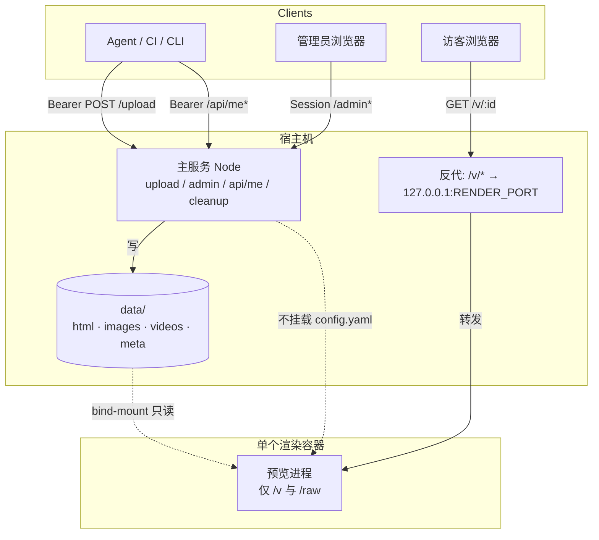

# 设计文档：vibeview 渲染 Sidecar（单容器预览）

> 状态：**已确认 · 已按默认建议实现**（2026-10-08）  
> 仓库：`git@github.com:lflish/vibeview.git`  
> 关联：[`docs/SPEC.md`](./SPEC.md) §5（P1-1）  
> 日期：2026-10-08（Asia/Shanghai）  
> 读者：贡献者 / 自托管运维；确认开放问题后按本文实现与测试

---

## 1. 目标与非目标

### 1.1 目标

1. **主服务留在宿主机**：`POST /upload`、`/admin*`、`/api/me*`、清理任务、账户/配额逻辑继续跑在 host 上的 Node 进程。  
2. **仅一个 Docker 容器**：专责对外提供预览页（`GET /v/:id`、`GET /v/:id/raw`）。  
3. **路径映射**：把宿主机 `data/`（或配置的存储根）挂进容器；**默认只读**，主服务独占写。  
4. **缩小预览面对宿主机主服务的牵连**：即使预览进程被打穿，也不应直接读到 `config.yaml`、admin 密码、账户 token、session 密钥。  
5. **对外 URL 不变**：访客仍访问 `{base_url}/v/<id>`；上传返回的链接无需改协议。  
6. **开发无 Docker 仍可跑通**：未启用 sidecar 时，主服务本地继续直接服务 `/v/*`（与现状一致）。

### 1.2 非目标

| 非目标 | 说明 |
| --- | --- |
| 整站进 Docker | 不把 upload / admin / preview 打成同一镜像或同一 compose 服务栈 |
| 每请求起浏览器 / Chromium 容器 | 不做无头渲染、截图模式（属 P2 另案） |
| 双全量栈 | 不做两套完整 vibeview（api + preview 各跑全功能） |
| 用 Docker「消灭」访客浏览器 XSS | 上传 HTML 仍在**访客浏览器**执行；sidecar 管的是**服务端进程与挂载面** |
| 对象存储同步进容器 | 本阶段仍是本地目录 bind-mount，不做 S3 复制管线 |
| 预览鉴权 / 签名 URL | 仍靠 nanoid 不可猜测性公开预览（除非后续另开需求） |

### 1.3 成功标准（本设计落地后）

- `docker compose up`（或等价 `docker run`）**只起渲染容器**；主服务仍 `node server.js`（或进程管理器）在 host。  
- 公网入口下，`/v/*` 由 sidecar 响应；`/upload`、`/admin`、`/api/me*` 仍走 host。  
- 容器内**无** `config.yaml`、**无** admin/token 密钥；data 建议只读。  
- 容器挂掉时：预览返回明确错误（推荐 **502**），**不**静默回退到 host 直出（见 §9）。  
- README / SPEC 写清边界：sidecar ≠ 浏览器 XSS 沙箱。

---

## 2. 架构图

### 2.1 逻辑架构（推荐：host 反代到 loopback 容器）

```text
                         公网 / 局域网
                              │
                              ▼
                 ┌────────────────────────────┐
                 │  Host 入口（推荐）          │
                 │  · 主服务内嵌 /v 反代，或   │
                 │  · Caddy/nginx 分流        │
                 └────────────┬───────────────┘
            ┌─────────────────┴─────────────────┐
            │ 非 /v/*                           │ /v/* 、/v/*/raw
            ▼                                   ▼
┌───────────────────────────┐     ┌──────────────────────────────┐
│ Host: vibeview main       │     │ 127.0.0.1:<render_port>        │
│ Node (Express)            │     │ Docker: render sidecar         │
│ · POST /upload            │     │ · GET /v/:id                   │
│ · /admin* /api/me*        │     │ · GET /v/:id/raw               │
│ · cleanup / accounts      │     │ · GET /healthz（容器内）         │
│ · 写 data/ + meta         │     │ · 读 data/（bind-mount, RO）   │
│ · 可选：仍保留直出 /v     │     │ · 无 config / 无密钥            │
│   （仅 preview.proxy=false）│     └──────────────────────────────┘
└─────────────┬─────────────┘                    ▲
              │ 写                              │ 只读挂载
              └────────── data/ ────────────────┘
```

### 2.2 Mermaid



### 2.3 与「整站 Docker」的对比（刻意不做）

```text
❌ 不做：
  compose: app (upload+admin+preview) + volume
✅ 做：
  host: node server.js
  compose: render only + bind data:ro
```

---

## 3. 组件职责

### 3.1 宿主机主服务（Host Main）

| 职责 | 说明 |
| --- | --- |
| 上传 | `POST /upload`、multer、类型白名单、`safeFilename`、写 `data/<type>/<id>/` + `meta/<id>.json` |
| 账户与配额 | Bearer → 账户；`/api/me*`；超限 `429`；启停状态 |
| 管理端 | `/admin*`、session、列表/删除/账户页 |
| 清理 | `lib/cleanup.js` 按保留期删 meta + 文件目录 |
| 配置与密钥 | 只读本地 `config.yaml`；**绝不**拷进渲染镜像或挂进容器 |
| 预览入口编排 | 当 `preview.proxy_to_render: true` 时，把 `/v/*` **反向代理**到 sidecar；关闭时本地直出（开发默认） |
| 健康 | 建议新增 host `GET /healthz`（含可选探测 sidecar） |
| 对外 `base_url` | 生成上传返回链接仍用 `server.base_url`（指向公网入口，不是容器端口） |

### 3.2 渲染 Sidecar（唯一容器）

| 职责 | 说明 |
| --- | --- |
| 预览 | `GET /v/:id`：HTML `sendFile`；image/video 用 viewer 壳页 |
| 原始文件 | `GET /v/:id/raw`：按 meta 的 mime 送文件（图/视频壳页依赖） |
| 读盘 | 仅读挂载的 data（meta + 文件）；**不写**业务数据 |
| 安全头 | 与现网一致的基础头（`nosniff` / `Referrer-Policy` / `X-Frame-Options` 等） |
| 健康 | 容器内 `GET /healthz` → 200（供 compose healthcheck / host 探测） |
| **不做** | 上传、admin、session、读 config、账户逻辑、cleanup 写删（删除仍由 host 完成；容器只读则自然无法删） |

### 3.3 边界约定

- **权威数据源**：宿主机 `data/`；容器是只读视图。  
- **权威权限源**：宿主机 config + `account-state.json`；容器无鉴权（预览公开）。  
- **进程边界**：主服务崩溃 ≠ 容器崩溃，反之亦然；预览故障不应拖垮 admin（见 §9）。

---

## 4. 数据挂载布局

### 4.1 宿主机目录（现状）

```text
<data_root>/                    # 常见为 ./data
  html/<id>/<filename>
  images/<id>/<filename>
  videos/<id>/<filename>
  meta/<id>.json
  account-state.json            # 运行时账户启停（仅 host 需要写/读）
```

配置里路径可为相对项目根的 `./data/html` 等；实现时应保证**容器内看到的布局与 host `lib/store` / `lib/config` 解析结果一致**（见 §4.3）。

### 4.2 推荐挂载

| 宿主机 | 容器内 | 模式 | 是否必须 |
| --- | --- | --- | --- |
| `./data`（或统一 `data_root`） | `/data` | **只读** `:ro` | 是（预览内容） |
| （可选）空 tmpfs | `/tmp` | rw | 若进程需要临时目录 |

### 4.3 容器内路径与配置

渲染进程**不读** host 的 `config.yaml`。应用环境变量（或极简 `render.env` / compose `environment`）声明存储根，例如：

```text
RENDER_DATA_ROOT=/data
RENDER_PORT=3001
# 与 host 一致的相对布局约定：
#   $RENDER_DATA_ROOT/html
#   $RENDER_DATA_ROOT/images
#   $RENDER_DATA_ROOT/videos
#   $RENDER_DATA_ROOT/meta
```

若运维自定义了 `html_dir` 等分散路径，本设计要求：**要么收敛到同一 `data_root` 子目录再挂载，要么显式挂多项**（实现时优先文档化「统一 data_root」以降低出错率）。`account-state.json` 即使落在 `data/` 下被挂进容器，容器也**不得**解析或使用它。

### 4.4 禁止挂载 / 禁止进入镜像

| 路径或内容 | 原因 |
| --- | --- |
| `config.yaml` | 含 admin 密码、session_secret、全部账户 token |
| `config.example.yaml` 以外的真实密钥文件 | 同上 |
| 宿主机项目源码中的 `.env`、私钥、SSH 目录 | 无关且危险 |
| 主服务 `node_modules` 整树（除非构建策略需要且无密钥） | 非必要扩大攻击面；镜像应自包含最小依赖 |
| Docker socket | 严禁 |

**原则**：渲染容器文件系统里即使被 root 逃逸（仍应非 root），也拿不到能上传、能登 admin 的秘密。

### 4.5 写权限策略

| 选项 | 说明 | 本设计默认 |
| --- | --- | --- |
| data **只读** | 主服务独占写；容器无法篡改/删除上传物 | **推荐默认** |
| data 读写 | 仅当未来容器内要写缓存时；增加误删与被利用写盘风险 | 不采用 |
| 根文件系统 `read_only: true` + `tmpfs /tmp` | 进一步限制容器写 | **推荐**（compose 中开启） |

---

## 5. 请求流

### 5.1 `GET /v/:id`（推荐：host 反代）

```text
访客
  → GET https://example.com/v/AbCdEfGhIjKlMnOp
  → Host 入口识别前缀 /v/
  → 反向代理到 http://127.0.0.1:3001/v/AbCdEfGhIjKlMnOp
  → Sidecar:
       1. 校验 id 格式（与 store.isValidId 一致）
       2. 读 /data/meta/<id>.json
       3. type=html → sendFile(/data/html/<id>/<filename>)
          type=image → viewer HTML（img src=/v/<id>/raw）
          type=video → viewer HTML（video src=/v/<id>/raw）
  → 响应经反代原样回到访客（状态码、Content-Type、body）
```

### 5.2 `GET /v/:id/raw`

```text
访客（或壳页内 /<video>）
  → GET .../v/<id>/raw
  → Host 反代 → Sidecar
  → 读 meta → sendFile 对应文件，Content-Type = meta.mime
```

图/视频预览页内的 `/v/:id/raw` 必须仍走**同一公网入口**（相对路径即可），以便继续被反代到 sidecar，而不是误打到未代理的路径。

### 5.3 上传与管理（仅 host，对照）

```text
Agent → POST /upload → Host 写 data → 返回 { url: base_url/v/id }
Admin → /admin* 、账户 API → 仅 Host
清理 → Host 删 meta + 文件目录；sidecar 下次读即 404
```

### 5.4 入口实现选项

| 方案 | 做法 | 优点 | 缺点 | 推荐 |
| --- | --- | --- | --- | --- |
| **A. 主服务内嵌反代** | Express 对 `/v`、`/v/:id/raw` 使用 `http-proxy-middleware`（或等价）转到 `preview.render_url` | 单端口、与现有部署兼容；`base_url` 不变 | 主服务多依赖；反代 bug 会影响入口 | **默认推荐** |
| **B. 前置 Caddy/nginx** | 运维层 `/v/*` → `127.0.0.1:3001`，其余 → `127.0.0.1:3000` | 主服务零反代代码；边界清晰 | 多一份运维配置；本地 dev 要文档示例 | 生产可选文档化 |
| **C. 主服务 internal fetch 再 pipe** | 收到 `/v` 后 `fetch(render)` 再写回 | 不暴露容器端口语义 | 缓冲/流式/大视频要小心；复杂度高于反代 | 不优先 |
| **D. 公网直连容器端口** | 访客打 `preview:3001` | 简单 | 扩大暴露面；易与 cookie/同源策略纠缠；违背「只绑 loopback」 | **不推荐** |
| **E. 302 到容器端口** | host 302 到 render | 实现省事 | 泄露内网端口或双入口；书签分裂 | **禁止对公网** |

**设计默认**：方案 **A**（host 内嵌反代到 `127.0.0.1`）；README 附方案 **B** 示例。`preview.proxy_to_render: false` 时走本地直出（开发无 Docker）。

---

## 6. 容器内进程选型

### 6.1 选项对比

| | **B. 精简 Node（复用 viewer）** | **A. 极简静态服务器** |
| --- | --- | --- |
| **内容** | 独立入口（如 `render-server.js`）：只挂 `/v`、`/raw`、`/healthz`；复用或抽出 `store` 读路径 + `viewer.js` | nginx/`busybox httpd`/Caddy file_server 按 URL 映到文件 |
| **HTML 预览** | 与现状一致 `sendFile` | 需把 URL 映射到 `html/<id>/<file>`；meta 驱动较别扭 |
| **图/视频壳页** | **直接复用** `lib/viewer.js` | 无动态壳页：要么预生成 HTML，要么改成纯文件直链（**改变产品行为**） |
| **攻击面** | Node + 少量依赖；无 multer/session/admin | 通常更小 |
| **镜像体积** | 中等（可 `node:*-alpine` + production deps 子集） | 更小 |
| **与现网一致性** | **高**（行为对齐现 `server.js` 预览分支） | 低，除非额外生成壳页 |
| **维护** | 与主仓共享读 meta/校验 id 逻辑，需避免拖进 config 密钥 | 两套映射规则，易漂移 |

### 6.2 推荐默认（待确认 · 设计决策 D2）

**推荐：选项 B — 精简 Node，只挂预览路由。**

**理由（摘要）**：

1. 产品现状依赖「图/视频 viewer 壳页 + `/raw`」；静态服务器要么改产品，要么再造一套壳页生成。  
2. 抽取「只读 store + viewer + 预览路由」成本可控，且与 host 行为一致，降低双实现漂移。  
3. 安全收益主要来自**不挂 config、只读 data、非 root、loopback、无上传/admin 代码路径**，而非「不用 Node」。  
4. 攻击面仍远小于整站容器：镜像内不包含 upload/admin/session 依赖与路由。

**备选**：若未来强制极致攻击面，可再评估「构建期为 image/video 写静态壳页 + nginx」；不作为 P1-1 默认。

> **标记**：本推荐为设计默认，**实现前需用户确认 D2**（见 §15）。

### 6.3 精简 Node 范围（若确认 B）

建议包含：

- 读环境变量中的 `RENDER_DATA_ROOT`、端口；**不** `require` 会加载 `config.yaml` 的完整 `lib/config.js`（或提供 `config.renderOnlyFromEnv()`）。  
- `isValidId` / `readMeta` / `filePath` 的只读实现。  
- `viewer.renderImage` / `renderVideo`。  
- 预览安全头中间件。  
- `GET /healthz` → `{ ok: true, role: "render" }`。

明确排除：multer、express-session、accounts、cleanup 写、views/admin、upload 路由。

---

## 7. 网络

### 7.1 绑定与端口

| 进程 | 监听 | 说明 |
| --- | --- | --- |
| Host 主服务 | `0.0.0.0:<server.port>`（现状，常 3000）或由前置反代对内 | 公网或内网入口 |
| Render sidecar | **仅** `127.0.0.1:<render_port>`（建议默认 **3001**） | 通过 Docker `ports: ["127.0.0.1:3001:3001"]` 发布 |

容器内进程可听 `0.0.0.0:3001`，由 Docker 发布规则限制为宿主机 loopback，避免局域网直打容器映射口。

### 7.2 防火墙 / 暴露原则

- 公网安全组 / 防火墙：**只放行** host 入口端口（或 80/443 到 Caddy）。  
- **不**对公网放行 `3001`。  
- 宿主机本地：主服务用 `http://127.0.0.1:3001` 作为 `preview.render_url`。  
- 容器网络：默认 bridge 即可；**推荐**关闭不必要出网（compose `network_mode` 或内部网络无 default gateway）。预览进程当前不主动外连；禁出网可降低 SSRF/回连价值。  
- 不挂 Docker socket；不做 `host` network 除非有强理由（默认不用）。

### 7.3 同源说明

短期：反代后访客眼中 `/v` 与 `/admin` **仍可同源**（同一 `base_url`）。这**不**解决「恶意预览页对管理端的 CSRF/同站影响」；缓解属 P2 分域名（SPEC P2-1）。本设计优先「密钥与写面不在预览进程」。

---

## 8. 威胁模型（仅针对本设计）

### 8.1 资产

| 资产 | 位置 | 敏感度 |
| --- | --- | --- |
| 账户 token、admin 密码、session_secret | Host `config.yaml` / 内存 session | 高 |
| 上传文件与 meta | Host `data/`（容器只读视图） | 中（内容可能敏感；链接不可猜测） |
| Admin session cookie | 访客浏览器 ↔ Host | 高 |
| 渲染进程本身 | 容器 | 低–中（被控后可读已上传公开预览文件） |

### 8.2 攻击者与场景

| ID | 场景 | 影响 | 本设计缓解 | 残余风险 |
| --- | --- | --- | --- | --- |
| T1 | 恶意 HTML 在**访客浏览器**执行 | 钓鱼、挖矿、打访客内网、同站请求 admin | **不在范围内**；文档声明可信上传；可选未来 sandbox | 高（产品假设） |
| T2 | 预览进程 RCE / 路径穿越读文件 | 读容器内可见文件 | 只读挂载 data；**不挂 config**；非 root；id 校验；最小依赖 | 仍可读 data 内所有预览文件（公开链接模型下可接受） |
| T3 | 预览进程写盘破坏或写马 | 篡改预览、持久化 | data `:ro`；根 FS read_only + tmpfs | 需防逃逸到宿主机（靠容器隔离基线） |
| T4 | 从容器逃逸到宿主机 | 控 host | 非 root、只读根、无 socket、限权限（可选 `cap_drop: ALL`） | 依赖 Docker/内核基线，非本应用可独保 |
| T5 | 扫描到暴露的 render 端口 | 绕过 host 策略直打预览 | **绑定 127.0.0.1**；防火墙不放行 | 误配 ports `0.0.0.0:3001` 会破坏假设 |
| T6 | 预览打穿后读 token 上传滥发 | 盗用账户 | 容器无 token / 无 upload 路由 | 无（相对整站容器） |
| T7 | 磁盘写满 | DoS | 配额在 host；容器只读不新增业务写 | 上传面仍在 host，靠已有配额 |
| T8 | 恶意 meta / 文件名 | 头注入、路径问题 | 复用 `isValidId`、既有 filename 净化；`sendFile` 基于 meta 拼路径且 id 约束 | 需保持与 host 同一套校验 |
| T9 | 容器挂了仍被 host「悄悄」用主进程带密钥的方式出预览 | 安全姿态不一致、运维误判 | **禁止静默回退**（§9） | 需配置与测试锁死 |

### 8.3 明确不声称

- 不声称「Docker 后可放心托管不可信 HTML」。  
- 不声称替代 CSP / iframe sandbox / 分域名。  
- 不声称防御宿主机主服务自身漏洞（上传面仍在 host）。

---

## 9. 失败模式

| 故障 | 表现 | 推荐行为 | 不推荐 |
| --- | --- | --- | --- |
| 容器未启动 / 崩溃 | 反代连不上 `127.0.0.1:3001` | Host 对 `/v/*` 返回 **502**（或 503）+ 简短正文；日志报错 | **静默回退**到 host 直出预览 |
| 容器慢 / 超时 | 代理超时 | 504 或 502；可配置超时 | 无限挂起 |
| meta 不存在 / id 非法 | 正常业务 | sidecar **404**（与现状一致） | — |
| data 挂载错误（空目录） | 全部 404 | 502/启动失败：compose healthcheck 失败；文档排查挂载 | 主服务假装预览正常 |
| Host 主服务挂、容器仍在 | 上传/管理不可用；若有人直连 3001 仍能预览 | 保持 3001 仅 loopback，公网只打挂掉的入口 → 整体不可用 | 把 3001 暴露成「降级公网入口」 |
| `proxy_to_render: false` | 开发模式 | Host **直接**服务 `/v`（现状）；不依赖容器 | 生产误关导致「以为隔离实际未隔离」—— README / 启动日志警告 |

### 9.1 为何禁止静默回退

1. **安全一致性**：开启 sidecar 表示运维选择「预览面不持有密钥」。回退到 host 直出会在故障时把预览流量带回全权进程，且无告警则长期双轨。  
2. **可观测性**：502 立刻暴露 compose/挂载问题；静默回退会掩盖故障。  
3. **明确开关**：需要无 Docker 开发时，用 **`preview.proxy_to_render: false`** 显式本地直出，而不是「连不上再回退」。

### 9.2 Host 健康检查建议

- `GET /healthz`（host）：主服务 ok。  
- 可选 `GET /healthz?deep=1` 或 `/healthz/render`：探测 sidecar `/healthz`；失败时 **200 + degraded** 或 **503**（实现时二选一写进配置，默认浅检查免耦合）。

---

## 10. 宿主机配置项（设计稿）

在 `config.yaml` / `config.example.yaml` 增加 `preview` 段（名称可微调，实现时与 SPEC 对齐）：

```yaml
server:
  port: 3000
  base_url: "http://localhost:3000"

preview:
  # false：主服务本地直出 /v（默认，兼容现有无 Docker 开发）
  # true：将 /v/* 反代到 render_url（生产启用 sidecar 时打开）
  proxy_to_render: false
  # sidecar 基址，仅 host 可达；不要填公网 URL
  render_url: "http://127.0.0.1:3001"
  # 反代超时（毫秒），可选
  proxy_timeout_ms: 30000
  # 启动时是否探测 render /healthz，失败仅打日志或拒绝启动（可选）
  # require_render_on_boot: false
```

环境变量覆盖（可选，便于 compose / systemd）：

| 变量 | 含义 |
| --- | --- |
| `DVIEW_PREVIEW_PROXY` | `true`/`false` → `proxy_to_render` |
| `DVIEW_RENDER_URL` | → `render_url` |

容器侧（compose `environment`，**不是** config.yaml）：

| 变量 | 含义 |
| --- | --- |
| `RENDER_PORT` | 默认 3001 |
| `RENDER_DATA_ROOT` | 默认 `/data` |

**注意**：`server.base_url` 始终指向**对外入口**（用户访问的 host），上传返回的 `/v/<id>` 不指向 `:3001`。

---

## 11. Docker / Compose 草图（仅起 render）

> 以下示意已落地为仓库中的 `Dockerfile.render` 与 `docker-compose.yml`（以实现为准）。

### 11.1 `Dockerfile.render`（示意）

```dockerfile
# 示意：精简 Node 预览镜像（若确认选项 B）
FROM node:22-alpine
WORKDIR /app
# 仅拷贝预览所需文件与 production 依赖子集
# COPY package.json package-lock.json ./
# RUN npm ci --omit=dev
# COPY render-server.js lib/viewer.js lib/store-readonly.js ./
USER node
ENV RENDER_PORT=3001 RENDER_DATA_ROOT=/data
EXPOSE 3001
CMD ["node", "render-server.js"]
```

### 11.2 `docker-compose.yml`（示意 · 只起 render）

```yaml
# 用法：docker compose up -d
# 主服务仍在宿主机： node server.js 且 preview.proxy_to_render: true
services:
  render:
    build:
      context: .
      dockerfile: Dockerfile.render
    read_only: true
    tmpfs:
      - /tmp
    volumes:
      - ./data:/data:ro
    ports:
      - "127.0.0.1:3001:3001"
    environment:
      RENDER_PORT: "3001"
      RENDER_DATA_ROOT: "/data"
    security_opt:
      - no-new-privileges:true
    cap_drop:
      - ALL
    healthcheck:
      test: ["CMD", "wget", "-qO-", "http://127.0.0.1:3001/healthz"]
      interval: 30s
      timeout: 3s
      retries: 3
    restart: unless-stopped
    # 可选：限制资源
    # mem_limit: 256m
    # pids_limit: 256
```

**刻意没有** `app` / `web` 主服务 service。

### 11.3 一键 run 等价

```bash
docker build -f Dockerfile.render -t vibeview-render .
docker run -d --name vibeview-render --read-only \
  --tmpfs /tmp -p 127.0.0.1:3001:3001 \
  -v "$(pwd)/data:/data:ro" \
  -e RENDER_DATA_ROOT=/data \
  vibeview-render
```

---

## 12. 计划改动的文件 / 目录（清单 · 不实现）

| 路径 | 动作 | 说明 |
| --- | --- | --- |
| `docs/design-render-sidecar.md` | 新增 | 本文 |
| `docs/SPEC.md` | 小改 | §5 增加指向本文 |
| `Dockerfile.render` | 待新增 | 仅预览镜像 |
| `docker-compose.yml` | 待新增 | 仅 `render` 服务 |
| `.dockerignore` | 待新增/改 | 排除 `config.yaml`、`data` 大文件、`.git` 等 |
| `render-server.js`（名称可议） | 待新增 | 容器入口；或 `bin/render-server.js` |
| `lib/store.js` / 只读拆分 | 待改或待增 | 避免预览入口加载密钥版 config |
| `lib/config.js` | 待改 | 解析 `preview.*`；render 侧 env 配置 |
| `server.js` | 待改 | 可选反代 `/v`；`/healthz`；关闭代理时保留直出 |
| `package.json` | 待改 | 可能增加 `http-proxy-middleware`（或手写 proxy）；script `render` |
| `config.example.yaml` | 待改 | `preview` 段 |
| `README.md` | 待改 | 部署：host 主服务 + compose render；安全边界 |
| `docs/SPEC.md` §7/§8 | 待改 | 验收项补充 sidecar；顺序指向设计确认 |
| `scripts/smoke-render.sh` 或扩 `smoke.sh` | 待新增 | sidecar 测试（见 §14） |
| `.github/workflows/…` | 可选 | 构建 render 镜像 / 冒烟 |

**不改**：账户模型、管理端 UX、CLI 上传协议（URL 仍是 `/v/<id>`）。

---

## 13. 发布与迁移

### 13.1 开发（无 Docker）

1. 保持 `preview.proxy_to_render: false`（默认）。  
2. `node server.js` 与今日相同，主服务直出 `/v/*`。  
3. 不要求安装 Docker。

### 13.2 生产启用 sidecar

1. 确保存储在统一可挂载的 `./data`（或文档所述 `data_root`）。  
2. `docker compose up -d` 起 render；确认 `curl -sS http://127.0.0.1:3001/healthz`。  
3. 配置 `preview.proxy_to_render: true`、`render_url: http://127.0.0.1:3001`。  
4. 重启 host 主服务；`curl` 公网 `/v/<已有 id>` 应 200。  
5. 刻意 `docker stop` render → `/v/<id>` 应 **502**，且 **不应**再从主进程出正文。

### 13.3 回滚

1. 设 `proxy_to_render: false`，重启主服务 → 立即回到 host 直出。  
2. 可停掉容器。  
3. 无需迁数据（data 始终在 host）。

### 13.4 兼容性

- 已有 `data/` 与 meta **无需迁移**。  
- CLI / Skill / Action 返回的 URL 不变。  
- 旧客户端无感，只要 `base_url` 仍指向同一入口。

---

## 14. Sidecar 测试计划

### 14.1 单元 / 组件（容器内逻辑）

- `isValidId` 拒绝非法 id。  
- 给定临时目录布局，读 meta 后 HTML / image / video / raw 响应正确。  
- 不存在 meta → 404。  
- 确认模块加载路径**不会**读取测试机上的真实 `config.yaml` 密钥（可用错误路径断言）。

### 14.2 集成（Docker + host）

| # | 步骤 | 期望 |
| --- | --- | --- |
| R1 | 仅起容器，错误挂载空 data | healthz 可 200；任意 `/v/id` → 404 |
| R2 | host 上传 HTML 后，直打 `127.0.0.1:3001/v/id` | 200，正文匹配 |
| R3 | `proxy_to_render: true`，经 host `base_url/v/id` | 200，同 R2 |
| R4 | 图片/视频：`/v/id` 为壳页且 `/raw` 可加载 | 200 |
| R5 | `docker stop render` 后经 host 访问 `/v/id` | **502/503**，非 200 业务页 |
| R6 | 容器文件系统内 `ls` 无 config；`docker inspect` 挂载含 `:ro` | 通过 |
| R7 | 端口监听：宿主机 `ss`/`curl` 仅 127.0.0.1:3001 | 非公网接口误暴露（测试环境检查 compose ports） |
| R8 | `proxy_to_render: false` 无容器 | host 直出仍 200（开发路径） |
| R9 | 只读挂载下，容器内尝试写 `/data` | 失败（可选负面测试） |
| R10 | healthcheck / `GET /healthz`（容器） | 200 |

### 14.3 回归（主服务）

既有上传、配额、admin、`/api/me` 冒烟在开启代理后仍应通过；删除资源后 sidecar 随即 404。

### 14.4 自动化建议

- `scripts/smoke-render.sh`：compose up → upload via host → curl via proxy → stop container → expect 502 → compose down。  
- CI：有 Docker 的 runner 跑 R2–R5；无 Docker 只跑 `proxy=false` 冒烟。

---

## 15. 开放问题（请用户拍板）

| # | 问题 | 选项 | 设计稿倾向 |
| --- | --- | --- | --- |
| **Q1 / D2** | 容器内跑什么？ | B 精简 Node（复用 viewer） / A 极简静态服务器 | **B** |
| **Q2 / D1** | data 进容器方式？ | 共享 bind-mount 只读 / 上传后复制进独立卷 | **bind-mount `:ro`** |
| **Q3** | 反代落点？ | A 主服务内嵌反代 / B 仅文档化 Caddy/nginx | **A 默认 + B 文档** |
| **Q4** | 容器挂掉时 host 行为？ | 502 且不回退 / 静默回退 host 直出 | **502，禁止静默回退** |
| **Q5** | 默认配置？ | 默认 `proxy_to_render: false`（dev 友好） / 默认 true | **默认 false** |
| **Q6** | 存储路径约束？ | 强制文档化统一 `data_root` 子目录 / 支持任意分散路径多挂载 | **优先统一 data_root** |
| **Q7** | 容器出网？ | 禁出网 / 默认 bridge 可出网 | **倾向禁出网或无默认路由** |
| **Q8** | host `/healthz` 是否 deep 检查 sidecar？ | 浅检查 / deep 失败则 503 / deep 仅日志 | **浅检查默认；deep 可选** |
| **Q9** | 镜像基础？ | `node:alpine` / distroless 等 | **alpine 先落地** |
| **Q10** | 是否与「账户+UX+生态」同一 PR？ | 先合 P0 再单独 P1-1 PR / 一起 | **建议单独 PR（SPEC 序 3）** |

---

## 16. 实现前检查清单（确认后才动手）

- [x] Q1–Q4 已确认（至少 D2、挂载、502 策略、反代方案）  
- [x] SPEC §5 / 本文无冲突  
- [x] 仍遵守：不写整站 Docker、不做每请求浏览器容器  
- [x] 实现顺序：配置与反代开关 → render 入口 → Dockerfile/compose → 文档 → smoke-render  

---

## 17. 修订记录

| 日期 | 说明 |
| --- | --- |
| 2026-10-08 | 初稿：按用户「仅一个渲染容器 + 主服务宿主机 + 路径映射 + 先完整设计再动手」写成 |
| 2026-10-08 | 用户确认默认建议并开工；落地 render-server / Docker / host 反代 / smoke |

---

*设计已确认并落地实现（见仓库 `render-server.js` / `Dockerfile.render` / `docker-compose.yml`）。未强制 commit/push。*
